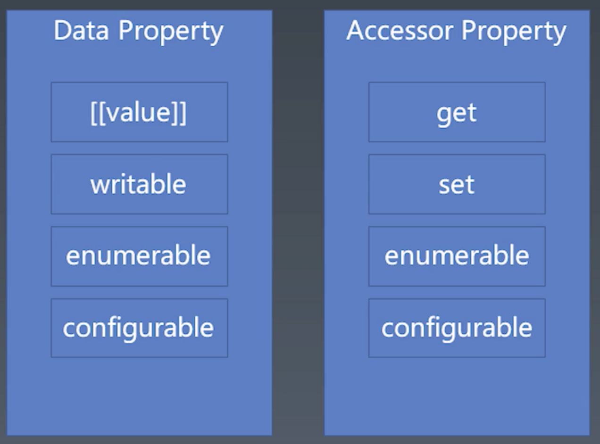
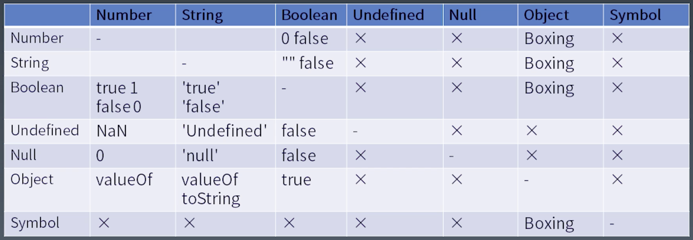
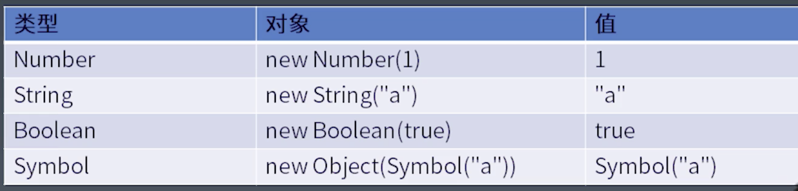

# 学习笔记

## 产生式（BNF）

1. 用尖括号扩起来的名称表示语法结构名
2. 语法结构分为基础结构和需要用其他语法结构定义的复合结构
    基础结构称终结符
    复合结构称非终结符
3. 引号和中间的字符表示终结符
4. 可以有括号
5. *表示重复多次
6. ｜表示或
7. +表示至少一次

## Number（浮点数的表示法）

语法分类：

1. 2进制只支持整数、以0b开头（后面只能是0/1）
    0b111
2. 十进制表示：允许有小数点
    0
    0.
    .2
    1e3(科学计数法)
3. 八进制以0o开头（后面只支持0-7）
    0o10
4. 十六进制（后面是0-9、A-F）
    0xFF

案例：

```js
0.toString()// wrong
0 .toString()// 必须给个空格
```

## String

字符集

1. ASCII编码（127个字符（0-127表示）只涉及到英文）（最多只占一个字节）
2. Unicode（作为标准）（编码集）（0000-FFFF）
3. GB（和Unicode不兼容）
    GB312
    GBK（GB13000）
    GB18030
4. ISO-8859
5. BIG5（台湾）

编码

UTF8默认一个字节表示一个字符，所有ASCII编码的文字同时也是UTF8编码的文字（反之不成立）

UTF16默认两个字节表示一个字符

## Boolean

## null（关键字）

## undefined(变量,可被赋值)

void 0 指代undefined

## object

唯一性、有状态、有行为（三要素）

object 机制（object --> object --> object --> null）

object-class

1. 描述对象的常见方式
2. 归类和分类是两个主要流派
3. 归类是提供共性生成类作为共性类
4. 分类是按照层级进行不同种类的归属分类

Object-prototype

1. 更接近于人类认知的描述对象的方法
2. 任何对象仅需要描述与原型的区别即可
3. 实现遵循了归类和分类的两个流派（自我认识）

object in javascript

1. key值可以是string和symbol
2. symbol只能通过变量去引用，否则无法访问（敲重点）
3. 分为数据属性和访问器属性
4. 数据属性用来描述状态（7中基本类型均可）
5. 访问器属性用来描述行为
6. 数据属性存储函数也可描述行为



object API

1. 创建对象(通过语法创建对象、访问属性和定义新的属性以及去改变属性的特征值)
    {}.[]  Object.defineProperty
2. 基于原型描述对象的方法
    Object.create/Object.setPrototypeOf/Object.getPrototypeOf
3. 基于类的方式描述对象
    new/class/extends
4. 历史包袱(弃用)
    new/function/prototype

特殊对象Function

1. 除了一般对象的属性和原型，函数对象还有一个行为[[call]]
2. 箭头函数和Function构造函数都会有call行为（函数执行访问的是call行为）

## 类型转换



Boxing



## 宏任务微任务

js执行粒度（运行时）

1. 宏任务
2. 微任务（promise）
3. 函数调用
4. 语句/声明
5. 表达式
6. 直接量/变量/this ...

## 函数调用

